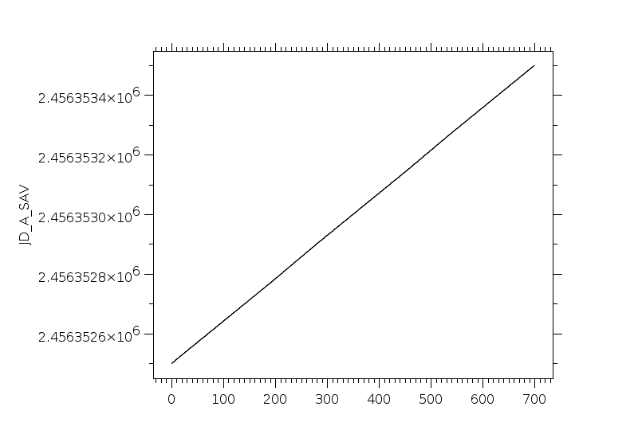
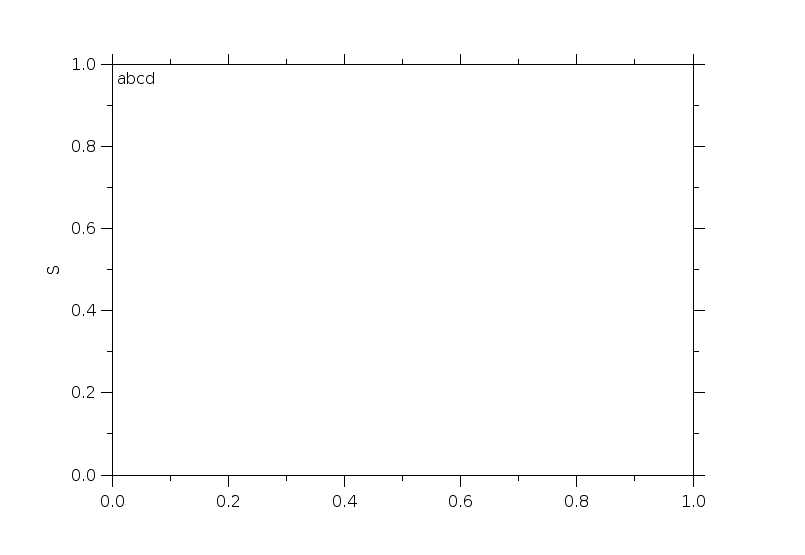
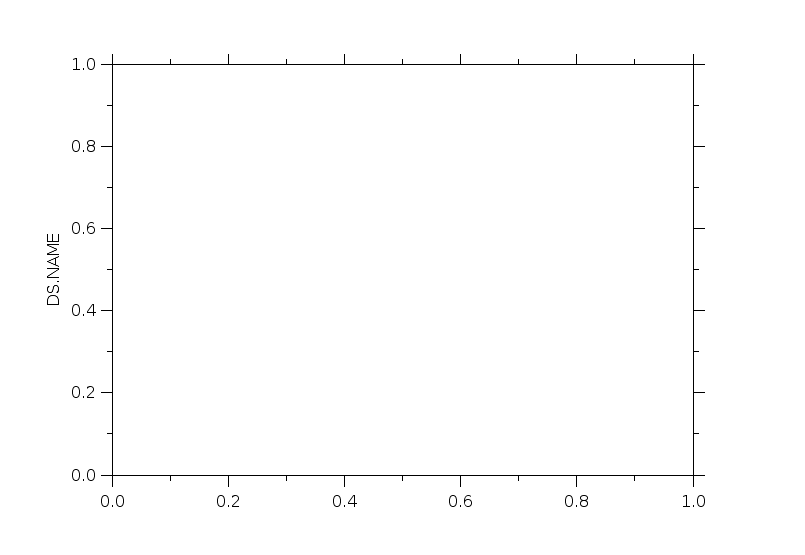
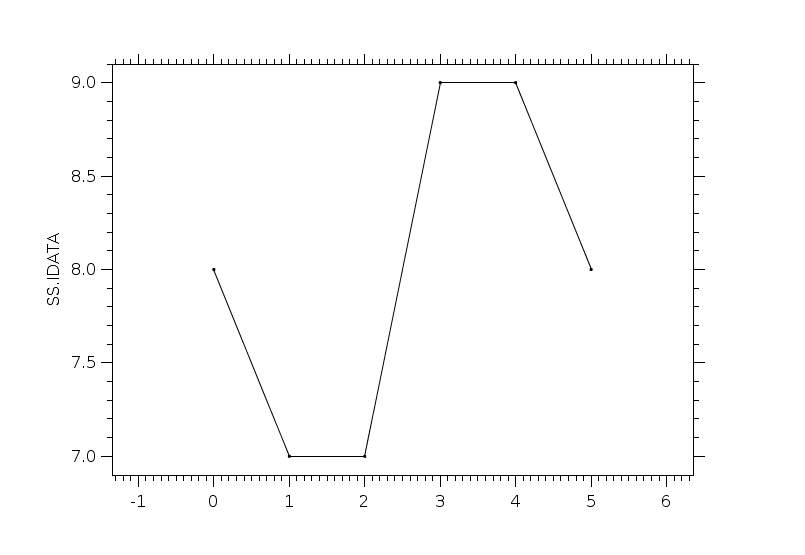
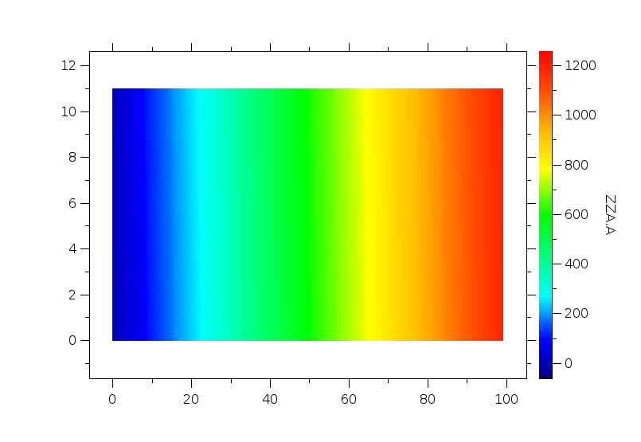
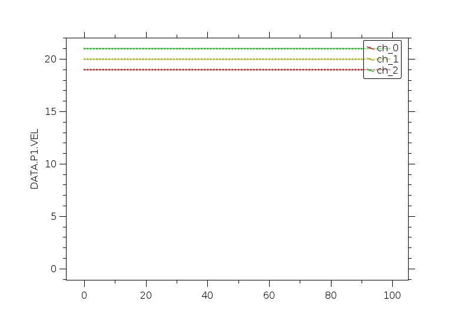
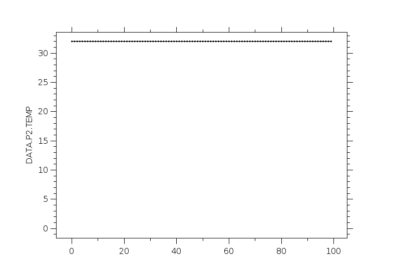
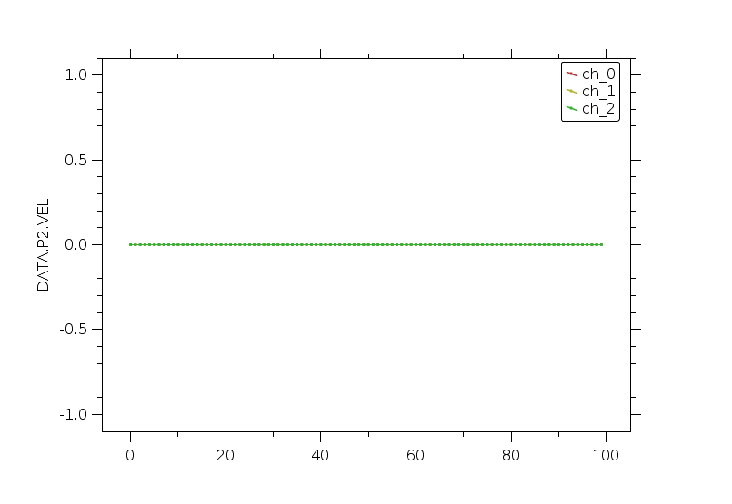
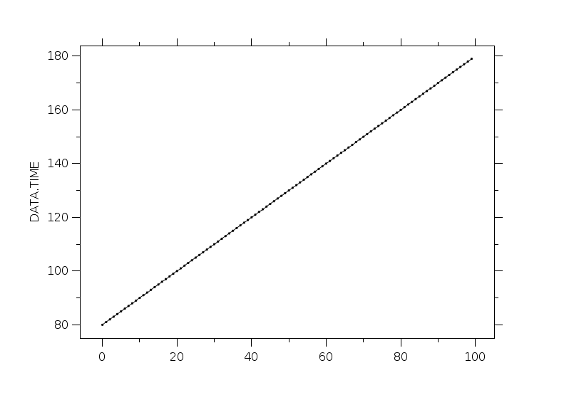
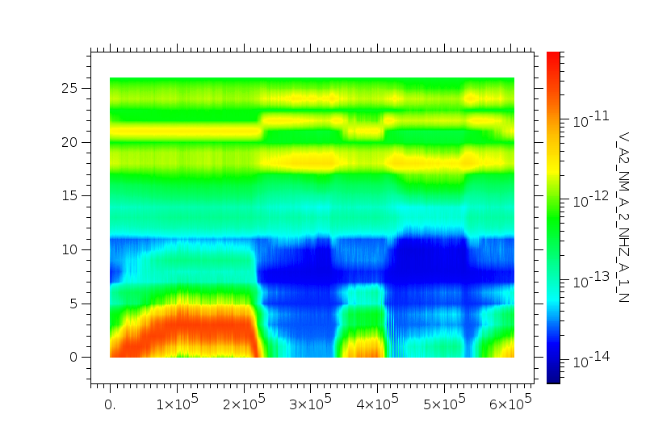

|      |      |      |
| ---- | ---- | ---- |
| 1001 | XXX | XXX |
| 1001 | REPT_A-PSD_20130301.sav?JD_A_SAV |  |
| 1002 | REPT_A-PSD_20130301.sav?K_A_SAV |  |
| 1003 | REPT_A-PSD_20130301.sav?PITCHANGLE_A_SAV |  |
| 1004 | REPT_A-PSD_20130301.sav?LSTAR_A_SAV |  |
| 1005 | REPT_A-PSD_20130301.sav?MU_A_SAV |  |
| 1006 | REPT_A-PSD_20130301.sav?PSD_A_SAV |  |
| 1007 | arrayOfStruct.idlsav?ZZ.ZZ |  |
| 1008 | arrayOfStruct.idlsav?ZZ.XX |  |
| 1009 | arrayOfStruct.idlsav?ZZ.YY |  |
| 1010 | arrayOfStruct1Var.idlsav?YY.ZZ |  |
| 1011 | arrayOfStruct2Var.idlsav?ZZ.YY |  |
| 1012 | arrayOfStruct2Var.idlsav?ZZ.ZZ |  |
| 1013 | arrayVsScalar.idlsav?B |  |
| 1014 | arrayVsScalar.idlsav?BB |  |
| 1015 | arrays.idlsav?A |  |
| 1016 | arrays.idlsav?I |  |
| 1017 | arrays.idlsav?F |  |
| 1018 | arrays.idlsav?D |  |
| 1019 | arrays.idlsav?S |  |
| 1020 | doublearray.idlsav?DA |  |
| 1021 | floats.idlsav?FF |  |
| 1022 | floats.idlsav?DD |  |
| 1023 | makeArrayOfString.idlsav?DATA |  |
| 1024 | makeArrayOfString.idlsav?SCALAR1 |  |
| 1025 | makeArrayOfString.idlsav?SCALAR2 |  |
| 1026 | scalars.idlsav?A |  |
| 1027 | scalars.idlsav?B |  |
| 1028 | scalars.idlsav?C |  |
| 1029 | scalars.idlsav?S |  |
| 1030 | simple.idlsav?ABCD |  |
| 1031 | simple.idlsav?IJKL |  |
| 1032 | simple.idlsav?EFGH |  |
| 1033 | slice.ds.idlsav?DS.ENERGYTAGS.UNITS |  |
| 1034 | slice.ds.idlsav?DS.ENERGYTAGS.DATA |  |
| 1035 | slice.ds.idlsav?DS.ENERGYTAGS.SCALETYP |  |
| 1036 | slice.ds.idlsav?DS.NAME |  |
| 1037 | slice.ds.idlsav?DS.TIMETAGS_RANGE |  |
| 1038 | slice.ds.idlsav?DS.DATA |  |
| 1039 | slice.ds.idlsav?DS.DEPEND_0 |  |
| 1040 | stringVsStrarr.sav?S |  |
| 1041 | stringVsStrarr.sav?SS |  |
| 1042 | strings.sav?STR0 |  |
| 1043 | strings.sav?STRS |  |
| 1044 | structCIL.sav?SS.I2DATA |  |
| 1045 | structCIL.sav?SS.IDATA |  |
| 1046 | structCIL.sav?SS.LDATA |  |
| 1047 | structOfArray.idlsav?ZZA.A |  |
| 1048 | structOfArray.idlsav?ZZA.B |  |
| 1049 | structOfArrayTypes.sav?SS.SDATA |  |
| 1050 | structOfArrayTypes.sav?SS.FDATA |  |
| 1051 | structOfArrayTypes.sav?SS.DDATA |  |
| 1052 | structOfArrayTypes.sav?SS.IDATA |  |
| 1053 | structOfArrayTypes.sav?SS.LDATA |  |
| 1054 | structOfArrayTypes.sav?SS.IDATA2 |  |
| 1055 | structOfArrayTypes.sav?SS.FDATA2 |  |
| 1056 | structSFD.sav?SS.SDATA |  |
| 1057 | structSFD.sav?SS.FDATA |  |
| 1058 | structSFD.sav?SS.DDATA |  |
| 1059 | struct_r123.sav?STRC.IDATA_R1 |  |
| 1060 | struct_r123.sav?STRC.IDATA_R2 |  |
| 1061 | struct_r123.sav?STRC.IDATA_R3 |  |
| 1062 | struct_r123.sav?STRC.FDATA_R1 |  |
| 1063 | struct_r123.sav?STRC.FDATA_R2 |  |
| 1064 | struct_r123.sav?STRC.FDATA_R3 |  |
| 1065 | structure.idlsav?ABC.X |  |
| 1066 | structure.idlsav?ABC.Y |  |
| 1067 | structure.idlsav?ABC.Z |  |
| 1068 | structureOfLonarr.idlsav?SS.XX |  |
| 1069 | structureOfLonarr.idlsav?SS.YY |  |
| 1070 | structureOfLonarr.idlsav?SS.ZZ |  |
| 1071 | structureWithinStructure.idlsav?BB.ZZ.XX |  |
| 1072 | structureWithinStructure.idlsav?BB.ZZ.YY |  |
| 1073 | structureWithinStructure.idlsav?BB.QQ |  |
| 1074 | stuctOfStruct.idlsav?DATA.P1.DENS |  |
| 1075 | stuctOfStruct.idlsav?DATA.P1.TEMP |  |
| 1076 | stuctOfStruct.idlsav?DATA.P1.VEL |  |
| 1077 | stuctOfStruct.idlsav?DATA.P2.DENS |  |
| 1078 | stuctOfStruct.idlsav?DATA.P2.TEMP |  |
| 1079 | stuctOfStruct.idlsav?DATA.P2.VEL |  |
| 1080 | stuctOfStructOfStruct.idlsav?DATA.TIME |  |
| 1081 | stuctOfStructOfStruct.idlsav?DATA.PAR.P1 | XXX |
| 1082 | stuctOfStructOfStruct.idlsav?DATA.PAR.P2 | XXX |
| 1083 | stuctOfStructOfStructFloat.idlsav?DATA.TIME |  |
| 1084 | stuctOfStructOfStructFloat.idlsav?DATA.PAR.P1 | XXX |
| 1085 | stuctOfStructOfStructFloat.idlsav?DATA.PAR.P2 | XXX |
| 1086 | vnames.idlsav?A |  |
| 1087 | vnames.idlsav?AA |  |
| 1088 | vnames.idlsav?AAA |  |
| 1089 | vnames.idlsav?AAAA |  |
| 1090 | vnames.idlsav?AAAAA |  |
| 1091 | waves_survey_mode3.idlsav?SCET___USER_PROPERTIESPTRANGE_ |  |
| 1092 | waves_survey_mode3.idlsav?V_A2_NM_A_2_NHZ_A_1_N |  |
| 1093 | waves_survey_mode3.idlsav?FREQPT__HZ_ |  |
