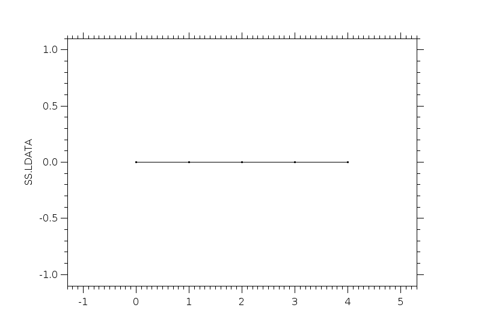
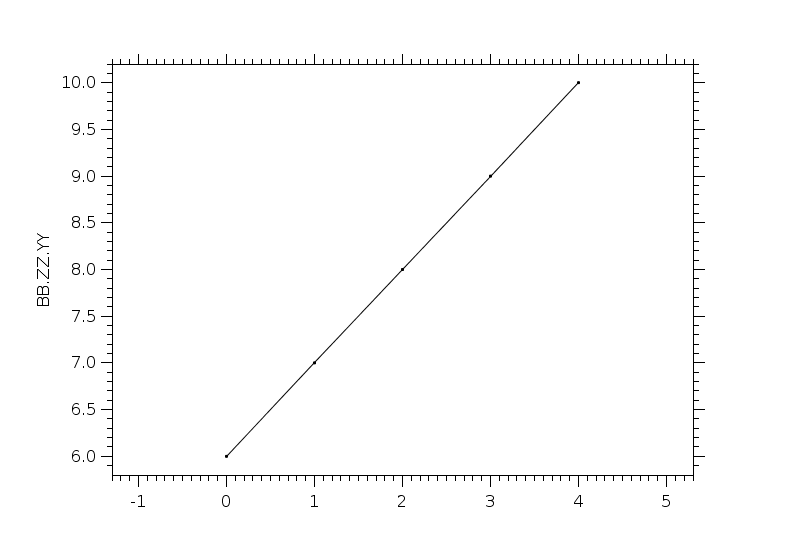

|      |      |      |
| ---- | ---- | ---- |
| -1 | XXX | XXX |
| 72507636 | REPT_A-PSD_20130301.sav?JD_A_SAV |  |
| 1827677561 | REPT_A-PSD_20130301.sav?K_A_SAV |  |
| 231783309 | REPT_A-PSD_20130301.sav?PITCHANGLE_A_SAV |  |
| 1853179930 | REPT_A-PSD_20130301.sav?LSTAR_A_SAV |  |
| 1086335262 | REPT_A-PSD_20130301.sav?MU_A_SAV |  |
| 1290924003 | REPT_A-PSD_20130301.sav?PSD_A_SAV |  |
| 1966823569 | arrayOfStruct.idlsav?ZZ.ZZ |  |
| 1966823633 | arrayOfStruct.idlsav?ZZ.XX |  |
| 1966823601 | arrayOfStruct.idlsav?ZZ.YY |  |
| 1548703591 | arrayOfStruct1Var.idlsav?YY.ZZ |  |
| 194440614 | arrayOfStruct2Var.idlsav?ZZ.YY |  |
| 194440582 | arrayOfStruct2Var.idlsav?ZZ.ZZ |  |
| 197871706 | arrayVsScalar.idlsav?B |  |
| 1839055524 | arrayVsScalar.idlsav?BB |  |
| 2029374483 | arrays.idlsav?A |  |
| 2029374475 | arrays.idlsav?I |  |
| 2029374478 | arrays.idlsav?F |  |
| 2029374480 | arrays.idlsav?D |  |
| 2029374465 | arrays.idlsav?S | XXX |
| 631673023 | doublearray.idlsav?DA |  |
| 622884175 | floats.idlsav?FF |  |
| 622884239 | floats.idlsav?DD |  |
| 1015735479 | makeArrayOfString.idlsav?DATA | XXX |
| 2096155240 | makeArrayOfString.idlsav?SCALAR1 |  |
| 2096155239 | makeArrayOfString.idlsav?SCALAR2 |  |
| 432388672 | scalars.idlsav?A |  |
| 432388671 | scalars.idlsav?B |  |
| 432388670 | scalars.idlsav?C |  |
| 432388654 | scalars.idlsav?S |  |
| 288296334 | simple.idlsav?ABCD |  |
| 288542606 | simple.idlsav?IJKL |  |
| 288419470 | simple.idlsav?EFGH |  |
| 1594823196 | slice.ds.idlsav?DS.ENERGYTAGS.UNITS |  |
| 189474621 | slice.ds.idlsav?DS.ENERGYTAGS.DATA |  |
| 150410476 | slice.ds.idlsav?DS.ENERGYTAGS.SCALETYP |  |
| 1272372709 | slice.ds.idlsav?DS.NAME |  |
| 1059714338 | slice.ds.idlsav?DS.TIMETAGS_RANGE |  |
| 1272075012 | slice.ds.idlsav?DS.DATA |  |
| 1909168503 | slice.ds.idlsav?DS.DEPEND_0 |  |
| 159831756 | stringVsStrarr.sav?S |  |
| 659817223 | stringVsStrarr.sav?SS | XXX |
| 1904918526 | strings.sav?STR0 |  |
| 1904918491 | strings.sav?STRS | XXX |
| 1633066611 | structCIL.sav?SS.I2DATA |  |
| 1991808295 | structCIL.sav?SS.IDATA |  |
| 1989037732 | structCIL.sav?SS.LDATA |  |
| 517880621 | structOfArray.idlsav?ZZA.A |  |
| 517880622 | structOfArray.idlsav?ZZA.B |  |
| 468254936 | structOfArrayTypes.sav?SS.SDATA | XXX |
| 480260709 | structOfArrayTypes.sav?SS.FDATA |  |
| 482107751 | structOfArrayTypes.sav?SS.DDATA |  |
| 477490146 | structOfArrayTypes.sav?SS.IDATA |  |
| 474719583 | structOfArrayTypes.sav?SS.LDATA |  |
| 1917292588 | structOfArrayTypes.sav?SS.IDATA2 |  |
| 2003180041 | structOfArrayTypes.sav?SS.FDATA2 |  |
| 2039371752 | structSFD.sav?SS.SDATA | XXX |
| 2051377525 | structSFD.sav?SS.FDATA |  |
| 2053224567 | structSFD.sav?SS.DDATA |  |
| 1303924148 | struct_r123.sav?STRC.IDATA_R1 |  |
| 1303924147 | struct_r123.sav?STRC.IDATA_R2 |  |
| 1303924146 | struct_r123.sav?STRC.IDATA_R3 |  |
| 2057579439 | struct_r123.sav?STRC.FDATA_R1 |  |
| 2057579440 | struct_r123.sav?STRC.FDATA_R2 |  |
| 2057579441 | struct_r123.sav?STRC.FDATA_R3 |  |
| 364021695 | structure.idlsav?ABC.X |  |
| 364021696 | structure.idlsav?ABC.Y |  |
| 364021697 | structure.idlsav?ABC.Z |  |
| 1849249932 | structureOfLonarr.idlsav?SS.XX |  |
| 1849249900 | structureOfLonarr.idlsav?SS.YY |  |
| 1849249868 | structureOfLonarr.idlsav?SS.ZZ |  |
| 1131752401 | structureWithinStructure.idlsav?BB.ZZ.XX |  |
| 1131752369 | structureWithinStructure.idlsav?BB.ZZ.YY |  |
| 730470911 | structureWithinStructure.idlsav?BB.QQ |  |
| 1926667034 | stuctOfStruct.idlsav?DATA.P1.DENS |  |
| 1927143656 | stuctOfStruct.idlsav?DATA.P1.TEMP |  |
| 1877494807 | stuctOfStruct.idlsav?DATA.P1.VEL |  |
| 1955296185 | stuctOfStruct.idlsav?DATA.P2.DENS |  |
| 1955772807 | stuctOfStruct.idlsav?DATA.P2.TEMP |  |
| 1876571286 | stuctOfStruct.idlsav?DATA.P2.VEL |  |
| 322566950 | stuctOfStructOfStruct.idlsav?DATA.TIME |  |
| 870969029 | stuctOfStructOfStruct.idlsav?DATA.PAR.P1 | XXX |
| 870969028 | stuctOfStructOfStruct.idlsav?DATA.PAR.P2 | XXX |
| 1129238856 | stuctOfStructOfStructFloat.idlsav?DATA.TIME |  |
| 1306409881 | stuctOfStructOfStructFloat.idlsav?DATA.PAR.P1 | XXX |
| 1306409882 | stuctOfStructOfStructFloat.idlsav?DATA.PAR.P2 | XXX |
| 1112874901 | vnames.idlsav?A |  |
| 139383628 | vnames.idlsav?AA |  |
| 25925237 | vnames.idlsav?AAA |  |
| 803682412 | vnames.idlsav?AAAA |  |
| 855648939 | vnames.idlsav?AAAAA |  |
| 1247792297 | waves_survey_mode3.idlsav?SCET___USER_PROPERTIESPTRANGE_ |  |
| 791904077 | waves_survey_mode3.idlsav?V_A2_NM_A_2_NHZ_A_1_N |  |
| 2076288391 | waves_survey_mode3.idlsav?FREQPT__HZ_ |  |
