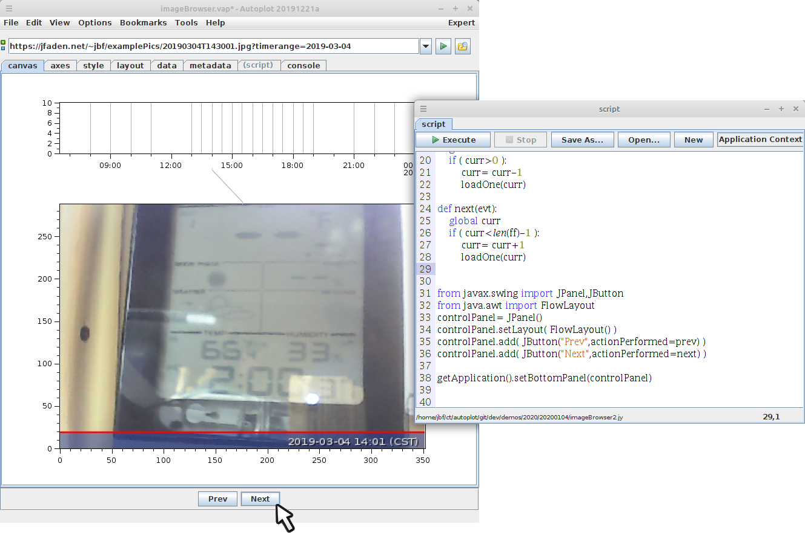

This demos how a the context property of a plot can be used to draw a connector 
to a time series, in this case an availability plot.

imageBrowser2.jy is a script that is more flexible for those comfortable with the
Jython scripting environment.  It loads the names into an array and creates an
array of times for each image, then adds a next/prev panel to the GUI.

