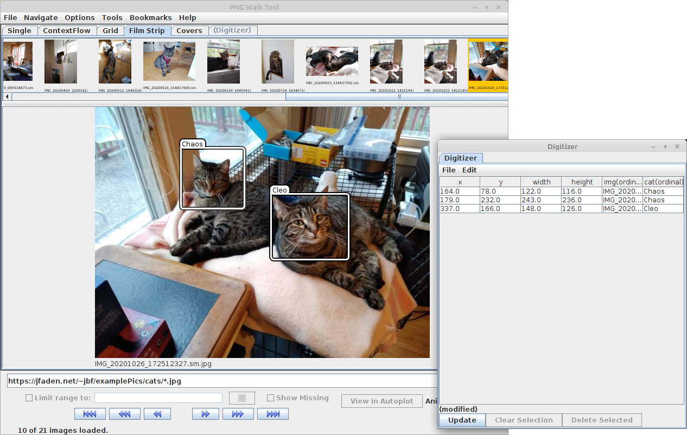

This demos how a more customized digitizer can be added to the PNG Walk Tool.
This script creates a PNGWalkTool and points it to the photos at
https://jfaden.net/~jbf/examplePics/cats/*.jpg, a set of pictures of Jeremy's
cats.  The digitizer script lets the user draw boxes around items in the 
pictures, and attaches a label "Chaos" or "Cleo" to each box.  

This uses nominal data (EnumerationUnits) to store the cat names and image names.
A DataPointRecorder is used to record the data.  The script registers listeners to
it to draw the points and the selected points in the recorder.  A Painter 
(BoxPainter) is used to draw the boxes over the images, and a MouseAdapter is
added to handle mouse events.

This requires Autoplot version 20201120a or v2020a_13 to run.

# Making your own versions of this
A couple things to know if you want to start with this script and modify it to meet 
your own needs.  

First, if you need data coordinates and not pixel coordinates, rich PNG 
metadata can be used to perform the axis transformations.

Second, if you want to handle left click differently than middle click, you can
get the button property for on the event:
~~~~~
    print 'button=', evt.button
    print 'modifiers=', evt.modifiers
    print 'modifiersText=', evt.getMouseModifiersText(evt.modifiers)
~~~~~
