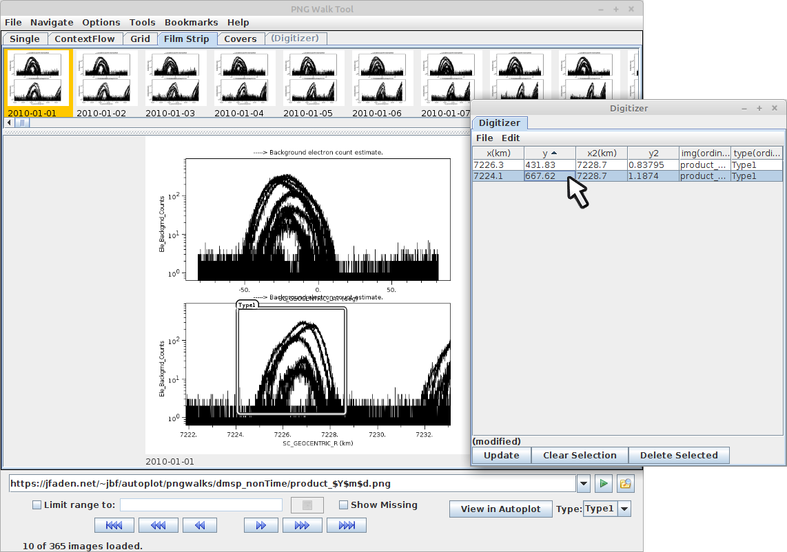

The <a href='pngwalkCustomDigitizerData.jy'>pngwalkCustomDigitizerData.jy script</a> 
demos a more practical digitizer, where data coordinates are recorded.  This works 
like the <a href='pngwalkCustomDigitizer.jy'>pngwalkCustomDigitizer.jy</a> script,
except that an additional layer is added: the pixel coordinates are converted
to data coordinates using "Rich PNG" metadata.

Rich PNG metadata is a convention defined years ago and is used with any Autoplot
output.  PNG files can have extra data fields of data, and we add an additional
one which is simply a JSON document describing axis titles, limits, and positions.
This allows many new features, like "grep" type searches on output files, but
also support for digitizing where mouse clicks are converted back into data
coordinates.  The intent was that any system, such as IDL or Python, would also have
code to produce this metadata, but this hasn't happened.  See http://autoplot.org/richPng.

# Using Rich PNG Metadata

This script has a similar form to the first script, but clickDigitizer is used
to convert from data coordinates in the table back to pixel coordinates, using
the method clickDigitizer.dataToPixelTransform.  This is a new routines which has
been added in v2020a_13.  

In the forward loop, clickDigitizer.pixelToDataTransform is used to find data 
coordinates for a mouse click.  

There's one last complication.  We need to be careful to consider just one of the plots.
The property "PlotNumber" shows which plot was clicked on, and we only register 
clicks on this plot.  (In the example PNGs, plot 0 is the bottom plot, but there
is no requirement that this be the order.)  When
dataToPixelTransform( 0, d[0:2] ) is called, note the "0" argument is to indicate
the bottom plot should be used for the transform.

