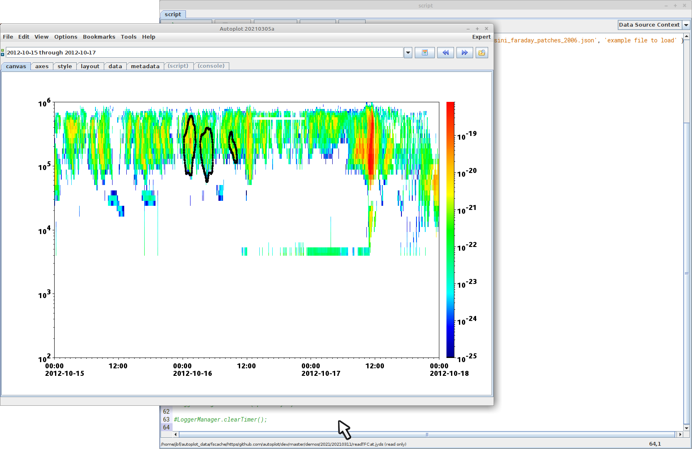

This is a Jython script for reading TFCat files from the MASER website.  This will be 
changing, and we expect that this functionality will be subsumed by built-in
code instead of the script.

Image using data from Das2Server at MASER and TFCat files via
DOI: https://doi.org/10.25935/r11g-6j63
