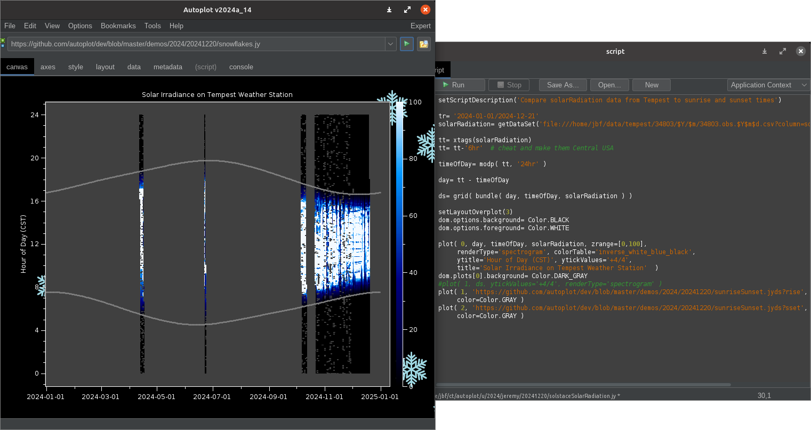

The script sunriseSunset.jyds reads the sunrise and sunset time files downloaded from https://aa.usno.navy.mil/.  This is a nice
example file because it is difficult to parse and also will make a nice example of a script with parameters
(lat, lon, and timezone) which can then be integrated into a HAPI server.

The script snowflakes.jy is a script which paints snowflakes outside of the one plot showing, to make a holiday screenshot
for Autoplot release <a href='https://autoplot.org/jnlp/20241221a'>20241221a</a>.

The script solstaceSolarRadiation.jy can only be run at Jeremy's site, and is provided for reference.  It was run, and then snowflakes.jy was run to add the snowflakes to create the screenshot below.

