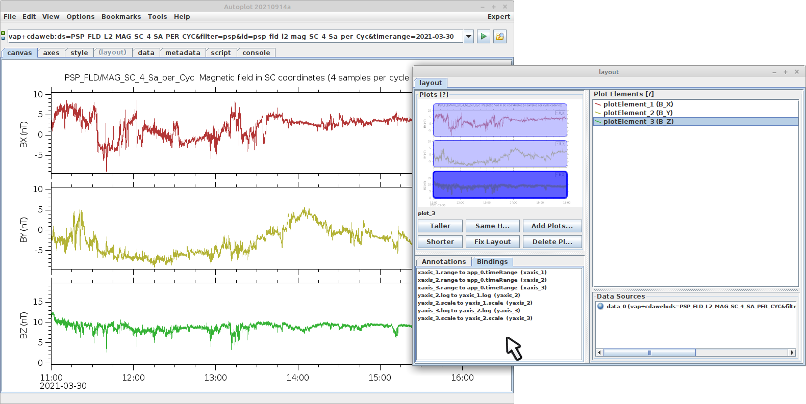

# Bindings

"Bindings" force properties of the plots and canvas to be equal.  For example,
if you plot two time series data sets from a CDF file to make a stack of two 
plots, the two plots will have their X-axis bound to a common "timeRange"
property.  

We add bindings, for example to have two Y-axes bound together.  To make
a binding, right-click on the yaxis and select bindings&rarr;"bind to plot 
below".

To remove a binding, select bindings &rarr; "remove bindings" and all bindings
with the axis will be removed, or on the layout tab, see the list under 
bindings..

Here are some example bindings:

* bind a stack plot together
* four plots, top two x-axis are bound, bottom two x-axes are bound, so you can show time shift.
* bind scale of y axes together
* bind scale of y axis and x axis to make an isotropic plot

Note bindings can be "absurd," meaning there's no solution, like if two plots
had their range and scale bound, but then they had different heights.  This
would cause an infinite loop as the properties send changes back and 
forth.  Autoplot will detect this, but the plot may left in an unpredictable 
state.  (The scientist shouldn't do this!)

Bindings are saved in the .vap file.

Also in scripts bindings can be created with a "converter", so you can do
funky things like have two axis bound with a delay.
