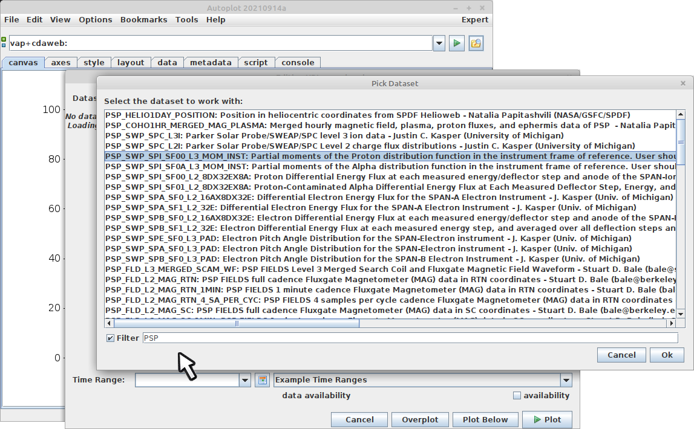
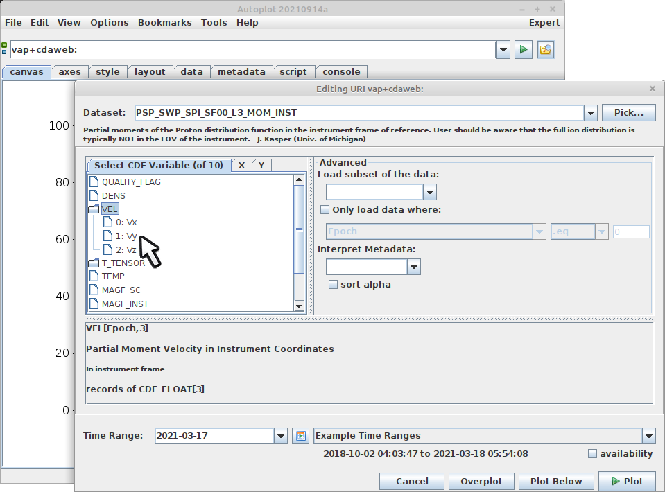
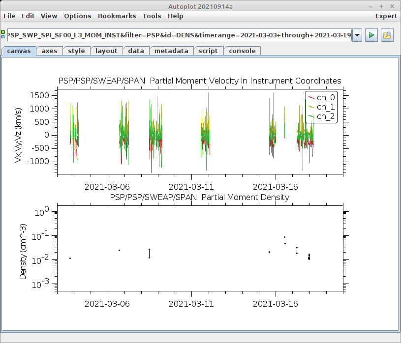

# CDAWeb Data Source
The CDAWeb data source connects to the server at Goddard and provides a browser
for their 1000+ data sets.  In Autoplot, you can say 
File&rarr;Add Plot From&rarr;CDAWeb and a browser showing all the collections
will come up after it downloads an index.  

Once a source is selected, the parameters within the source are shown.  Note
this is based on the CDF file source, so it has gone to CDAWeb and downloaded
an example file to see what's available within the CDF files there.  

You can re-enter the editor dialog and add another plot below.

