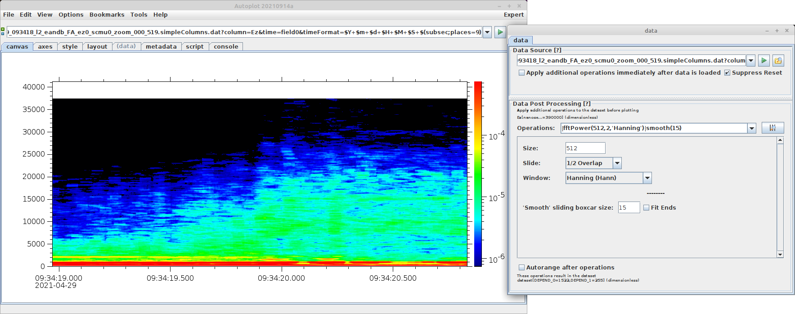

After the data is loaded, you can apply filters.  For example, you might 
have waveform data, but you want to look at the power spectrum for it.

The "jailbars" icon brings up an GUI to discover new filters.
