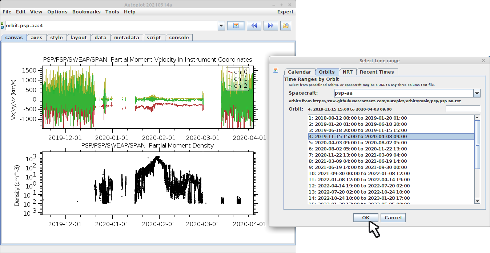

You may have noticed that Autoplot properly interprets strings into time
ranges.  For example, "May 2021" is the same as "2021-05-01 through 2021-05-31" 
which is the same as "2021-05-01T00:00Z/2021-06-01T00:00Z".  The time range
editor is a GUI which helps to create time ranges.  Also note you can browse
by orbit, which is often my useful than browsing by day.

Here a special string "orbit:psp-aa:4" is used to identify the time range for
the fourth orbit of Parker Solar Probe.  Clicking the "next" button advances
to the next orbit.

There is a ISO8601 time parser to handle time ranges using the international
standard, but it also has the keyword "now", which is useful for real-time 
plots, where you need to see what the most recent data looks like.  For example,
P5D/lastday is the 5-day long time interval ending at the last day boundary.

