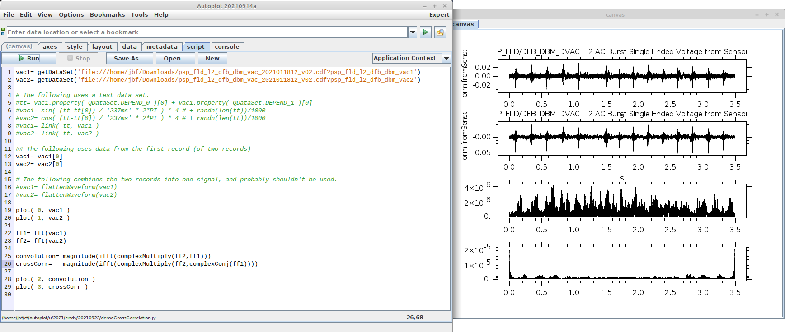

Autoplot uses Jython for scripting.  Jython is the Java-based Python, and it's
based on Python 2.2 (which is 15 years old now).  However the primary goal was
to provide scripting to Autoplot, and not python in particular.

# Use cases
* Pngwalk.  One of the original uses for scripting was to take the current
layout and run pngs it for each day of the mission.  (Pngwalk generation is
now built into Autoplot.)
* Animated gif and auralization of data.  Frames of the movie are produced with
a script, and Autoplot exports B-field data out as a wav file after some 
processing.  https://git.uiowa.edu/jbf/rbsp/-/blob/master/u/kris/2019/20190531/stereoBField20151222.jy
* file parsing.  Radiojove are these ground antennas, and the data is stored
in .sps format.  These are read in with a Jython script maintained by a domain 
expert.  
* file parsing.  Team in France has events data stored in JSON format 
(structured ASCII, like XML but simpler in some ways), I wrote a script to 
read in these files.
* data file management.  script looks at RBSP files at Iowa and
at CDAWeb (heliophysics data archive) to see what hasn't been sent over yet.
* complex graphics like Sadie's plot 

# Documentation
I've written documentation for scripting several times but it never seems 
effective.  However I finally linked to this version: 
https://github.com/autoplot/documentation/wiki/scripting
I get lots of emails asking how to do something, and I'm more than happy
to put together a demo.  

https://github.com/autoplot/dev/ contains hundreds of working examples, and good
search engine.  Cindy asked about autocorrelation, and I thought I'd put 
together a demo script, and I was able to find it within minutes.

# Autocorrelaton Example

This script takes two signals and shows the autocorrelation between them:

Note there's commented code I use to switch back and forth between test
and real data.  I can easily add a control to this script which lets me select
using a GUI:

