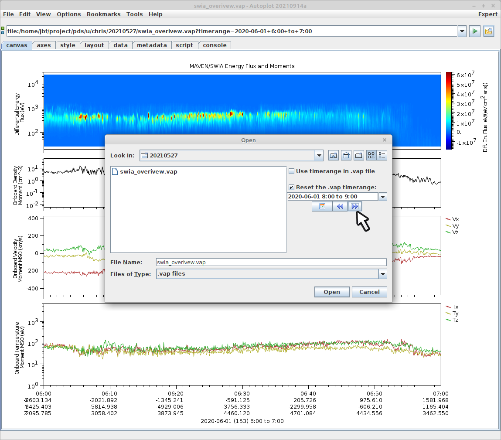

Once you are satisfied with the layout, you can save the plot out as a "vap
file."  This file contains the canvas size and plot positions, what bindings
and annotations exist, and the URIs to load and draw in each plot.  The vap
file can be posted on a web site or emailed to a colleague, analogous to a
Microsoft Word .doc file.  Note that data is not saved within the .vap 
file, so it will only work where the URIs are accessible.  

Also, if you have a script which calculates and plots data, that data does not
have a URI (you'll see vap+internal: when you click to focus on the data) 
and will not appear when the .vap file is loaded.

There is an option to create a special .vap.zip file, which is the .vap file
stored within a .zip file along with the data.  This is more portable, then, 
and is useful when collaborating.

One other thing to show about .vap files is when they are loaded, you have the
option of changing the timerange within.  This allows one vap file to be used
for any time.

